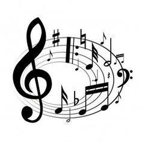
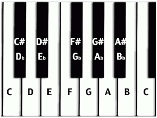

In the beggining, there was the 7 note chant,

.png)

and it was all the rave!

Which was 7 notes with the eighth being the octave,
or twice the frequency of the first note.

Then someone decided to write the music down,
and invented music theory!

A B C D E F G

But alas, musicians weren't satisfied with 7 notes,
so over time, settled on the natural base 12, i.e. 
12 notes per octave.  A 12 note scale is called a 
chromatic scale consisting of 12 semitones (or half 
steps or half tones) where the octave is divided into
approximate equal parts (can vary depending on tuning
used).  2 semitones are a tone or whole step.

Unfortunately the grey beards insisted on keeping
the 7 note, or diatonic, scale so ended up inserting the 
extra 5 notes and calling them flats or sharps.

To map 7 notes into twelve notes, the spacing is going to
have some variance as you need 5 whole tones and 2
half tones.  So how you arrange the whole and half
tones is called a mode.

The natual scale, is the white keys of an octave starting
at C.  This gives a W-W-H-W-W-W-H tones for C-D-E-F-G-A-B-C
